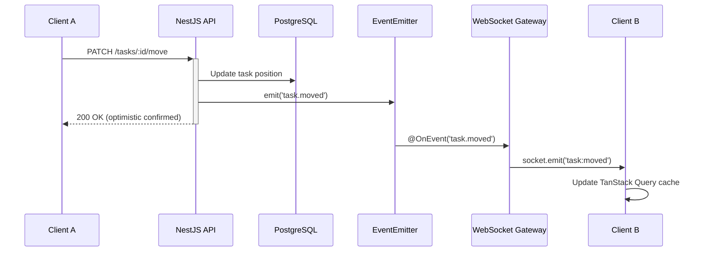
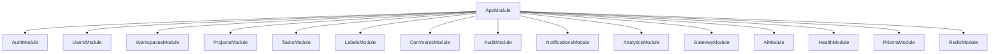

# FlowBoard

> **FlowBoard** is a real-time collaborative task management platform where multiple users can drag, assign, and track tasks simultaneously with instant sync. Built with Next.js 15, NestJS, WebSockets, PostgreSQL, Redis, and AI-powered task parsing.


---

## Technical Highlights

- **Real-time multi-user collaboration** via WebSocket with Redis pub-sub adapter -- events broadcast to all board members with sender exclusion for optimistic UI
- **Fractional indexing for drag-and-drop card ordering** -- O(1) reorder with automatic column rebalance when position gaps exhaust, no full-column reindex on every move
- **AI-powered natural language task creation** via command palette (Anthropic Claude) -- type "Fix login bug, high priority, assign to Sarah, due Friday" and it parses into structured task fields
- **Role-based access control with 4-tier workspace hierarchy** -- Owner, Admin, Member, Viewer roles with granular permission guards on every endpoint and WebSocket room
- **Event-driven architecture** decoupling domain logic from side effects -- NestJS EventEmitter bridges REST controllers to WebSocket gateway, audit logging, and notifications without tight coupling

---

## Tech Stack

| Layer        | Technology                                 |
|--------------|--------------------------------------------|
| Frontend     | Next.js 15 (App Router), React 19, Tailwind CSS v4 |
| State        | Zustand (client), TanStack Query (server)  |
| Backend      | NestJS 10 (modular monolith)               |
| Database     | PostgreSQL 16 via Prisma ORM               |
| Cache / Auth | Redis 7 (refresh tokens, caching)          |
| Real-Time    | Socket.IO (WebSocket gateway)              |
| Drag & Drop  | @dnd-kit                                   |
| Charts       | Recharts                                   |
| Monorepo     | pnpm workspaces                            |

---

## Key Features

- **Kanban Board** -- Drag-and-drop task cards across status columns with smooth animations and optimistic updates.
- **Real-Time Collaboration** -- WebSocket-powered live updates so every team member sees changes instantly.
- **Workspaces & RBAC** -- Multi-tenant workspaces with Owner, Admin, and Member roles controlling access to projects.
- **Project Analytics** -- Interactive dashboards with task distribution, priority breakdown, team workload, velocity tracking, and overdue task monitoring.
- **Command Palette** -- Keyboard-first navigation (Ctrl+K) for quick actions, search, and page navigation.
- **Dark Mode** -- Full light/dark/system theme support with CSS variable-based theming.
- **Rich Task Details** -- Subtasks, labels, due dates, story points, assignees, comments with a TipTap rich-text editor, and an activity audit trail.
- **Notifications & Background Jobs** -- Bull queue for email digests and scheduled overdue-task checks.

---

## Screenshots

> Replace these placeholder paths with actual screenshots.

| Board View | Analytics Dashboard |
|---|---|
|  |  |

| Command Palette | Dark Mode |
|---|---|
|  |  |

---

## Architecture Overview

### Monorepo Structure

```
flowboard/
  apps/
    api/          # NestJS backend (REST + WebSocket)
    web/          # Next.js 15 frontend (App Router)
  packages/       # Shared packages (future: shared types, configs)
  docker-compose.yml
  pnpm-workspace.yaml
```

### Backend Module Map

```
apps/api/src/
  auth/           # JWT authentication, refresh-token rotation, guards
  users/          # User CRUD, profile management
  workspaces/     # Workspace CRUD, member management, RBAC
  projects/       # Project CRUD, analytics endpoints
  tasks/          # Task CRUD, move/reorder, subtasks
  comments/       # Task comments with rich text
  labels/         # Workspace-scoped labels
  notifications/  # In-app notification system
  audit/          # Activity audit trail
  gateway/        # Socket.IO WebSocket gateway for real-time events
  prisma/         # Prisma service, schema, migrations, seed
  common/         # Shared decorators, guards, filters, pipes
```

### Data Model Summary

```
User  ---< WorkspaceMember >---  Workspace
                                    |
                                 Project
                                    |
                                  Task ---< Comment
                                   |  \---< TaskLabel >--- Label
                                   |
                                SubTask (self-relation)
```

- Users belong to Workspaces through a membership join table with roles.
- Each Workspace contains Projects; each Project contains Tasks.
- Tasks support self-referencing parent/child relationships for subtasks.
- Labels are scoped to a Workspace and attached to Tasks via a join table.

### Real-Time Collaboration Flow



### Module Dependency Diagram



---

## Key Decisions

### Why NestJS modular monolith over microservices

A modular monolith gives the organizational benefits of domain separation (each NestJS module owns its own controller, service, and DTOs) without the operational overhead of service mesh, inter-service communication, and distributed tracing. For a team-sized product, a single deployable with clean module boundaries is faster to develop, test, and debug. The module structure is designed so that any module can be extracted into a standalone service later if scaling demands it.

> **Considered:** Microservices with NestJS hybrid app (TCP/gRPC transport). **Rejected because** the operational complexity of service discovery, distributed transactions, and inter-service auth was unjustified for a team-sized product. A modular monolith provides the same code isolation with a single deployment target.

### Why Prisma over TypeORM

Prisma provides a declarative schema as the single source of truth, auto-generated type-safe client, and first-class migration tooling. TypeORM's decorator-heavy approach leads to runtime surprises and weaker type inference. Prisma's `schema.prisma` file is easy to review in pull requests and its generated types flow through the entire stack without manual DTO duplication.

> **Considered:** TypeORM with decorators and Drizzle ORM. **Rejected because** TypeORM's decorator-based entity definitions produce weaker type inference and runtime surprises, while Drizzle's ecosystem was too young for production use at project start. Prisma's generated client provides end-to-end type safety with zero manual DTO mapping.

### Why fractional indexing for card ordering

Traditional integer-position reordering requires updating every row between the old and new positions on each drag-and-drop, which causes O(n) writes and potential race conditions. Fractional indexing (storing position as a float or string-based fractional index) lets a card be inserted between two neighbors with a single row update, making real-time collaborative reordering safe and efficient.

> **Considered:** Integer-position reordering (shift all rows between old and new index) and linked-list ordering. **Rejected because** integer shifting causes O(n) writes per drag and creates race conditions with concurrent users. Linked-list ordering requires traversal for position lookups and complicates pagination. Fractional indexing achieves O(1) inserts with rare O(n) rebalance.

### Why Redis for refresh tokens and caching

Storing refresh tokens in Redis (rather than the database) gives O(1) lookup/revocation and automatic TTL-based expiry without cron jobs. Redis also serves as the caching layer for frequently-read data (workspace membership checks, project metadata) and as the pub/sub backbone for the Socket.IO adapter in multi-instance deployments.

> **Considered:** Storing refresh tokens in PostgreSQL and using in-memory caching with node-cache. **Rejected because** PostgreSQL requires manual TTL cleanup via cron jobs and adds latency to every token validation. In-memory caching breaks in multi-instance deployments and loses state on restart. Redis provides atomic TTL, pub/sub for Socket.IO adapter, and shared state across instances.

### Why Zustand + TanStack Query over Redux

Redux Toolkit adds ceremony (slices, thunks, selectors) that is unnecessary when TanStack Query already manages all server state (fetching, caching, background refetching, optimistic updates). Zustand handles the remaining client-only state (sidebar open/close, modal visibility) in a few lines with zero boilerplate. The combination keeps the bundle smaller and the mental model simpler.

> **Considered:** Redux Toolkit (RTK Query) and Jotai. **Rejected because** RTK Query duplicates TanStack Query's server-state management with more boilerplate (slices, thunks, selectors), and Jotai's atom-based model adds indirection for simple UI state like sidebar toggles. Zustand + TanStack Query cleanly separates client state from server state with minimal API surface.

### Why @dnd-kit over react-beautiful-dnd

react-beautiful-dnd is archived and unmaintained. @dnd-kit is actively maintained, supports multiple interaction modes (pointer, keyboard, touch), has a smaller bundle, and provides fine-grained control over collision detection and drag overlays needed for cross-column Kanban reordering.

> **Considered:** react-beautiful-dnd and pragmatic-drag-and-drop (Atlassian). **Rejected because** react-beautiful-dnd is archived/unmaintained with known React 18+ issues. Pragmatic-drag-and-drop was evaluated but its API is lower-level and requires more custom code for cross-column Kanban semantics. @dnd-kit provides the best balance of flexibility, maintenance, and bundle size.

---

## Getting Started

### Prerequisites

- **Node.js** >= 22
- **pnpm** >= 10
- **Docker** & **Docker Compose** (for PostgreSQL and Redis)

### Setup

```bash
# 1. Clone the repository
git clone https://github.com/your-username/flowboard.git
cd flowboard

# 2. Install dependencies
pnpm install

# 3. Start infrastructure (PostgreSQL + Redis)
docker compose up -d

# 4. Copy environment variables
cp apps/api/.env.example apps/api/.env

# 5. Run database migrations
pnpm db:migrate

# 6. Seed the database with sample data
pnpm db:seed

# 7. Start development servers (API + Web in parallel)
pnpm dev
```

The API runs on **http://localhost:3001** and the web app on **http://localhost:3000**.

---

## API Documentation

Once the API is running, interactive Swagger docs are available at:

```
http://localhost:3001/api/docs
```

---

## Future Improvements

- **GitHub / GitLab Integration** -- Link tasks to pull requests and auto-update status on merge.
- **File Attachments** -- Upload and attach files to tasks using S3-compatible object storage.
- **Timeline / Gantt View** -- Visualize task schedules and dependencies on a timeline.
- **Custom Fields** -- Allow workspaces to define custom task fields (dropdowns, dates, numbers).
- **Email Notifications** -- Digest emails for overdue tasks and assignment changes (Bull queue is already wired).
- **Activity Feed** -- A global feed aggregating recent actions across all projects in a workspace.
- **Mobile App** -- React Native companion app sharing the same API.
- **CI/CD Pipeline** -- GitHub Actions for lint, test, build, and deploy on push to main.

---

## About the Developer

Built by **Jerome** -- a senior full-stack developer based in the Philippines, specializing in TypeScript, React, NestJS, and real-time systems.

<!-- TODO: Replace with your actual portfolio URL and social links -->
- Portfolio: [coming soon](#)
- GitHub: [github.com/your-username](https://github.com/your-username)
- LinkedIn: [linkedin.com/in/your-profile](https://linkedin.com/in/your-profile)
