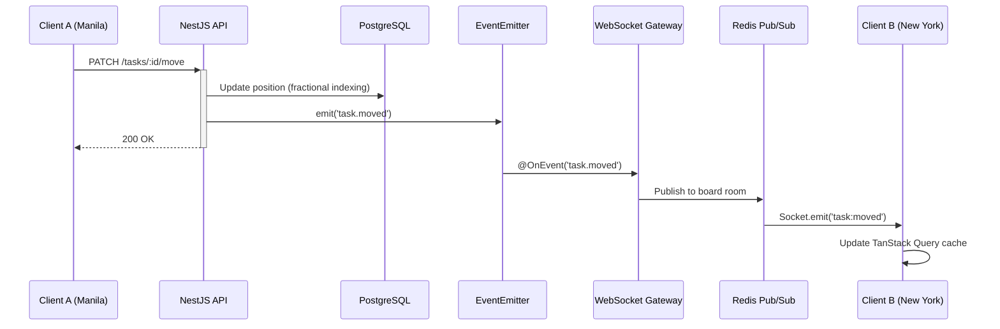
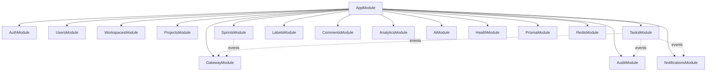

# FlowBoard

> **Real-Time Collaborative Task Management Platform**
> Built for distributed teams who need to move fast across timezones.

I built FlowBoard because I was managing three client projects simultaneously — US timezones, EU timezones, and local Philippine clients — and every tool I tried was either too heavy or too simple. I needed real drag-and-drop, instant multi-user sync, sprint planning that actually closes tickets, and enough structure to feel professional without feeling like filing taxes.

This is a **full-stack production-grade application** demonstrating: real-time WebSocket collaboration, event-driven architecture, RBAC with 4-tier role hierarchy, AI-powered task creation, sprint lifecycle management, and a comprehensive analytics dashboard — all organized as a modular NestJS monolith with a Next.js 15 frontend.

[](https://github.com/jeromejhipolito/flowboard/actions)


---

## System Overview

```
┌─────────────────────────────────────────────────────────────────────┐
│                        FRONTEND (Next.js 15)                        │
│  App Router • Server Components • TanStack Query • Zustand • DnD   │
├────────────────┬─────────────────────┬──────────────────────────────┤
│   REST API     │   WebSocket (WS)    │     Demo Mode (No Backend)   │
│   (Axios)      │   (Socket.IO)       │     (Mock Data Layer)        │
├────────────────┴─────────────────────┴──────────────────────────────┤
│                        BACKEND (NestJS 10)                          │
│  16 Modules • Guards • Interceptors • Event Emitter • Bull Queues  │
├────────────────┬─────────────────────┬──────────────────────────────┤
│  PostgreSQL    │     Redis           │     Anthropic API            │
│  (Prisma ORM)  │  (Cache/PubSub/     │     (AI Task Parsing)       │
│  10 migrations │   Tokens/Queues)    │                              │
└────────────────┴─────────────────────┴──────────────────────────────┘
```

---

## Key Features

### Core Platform
| Feature | Description | Technical Detail |
|---------|-------------|-----------------|
| **Kanban Board** | Drag-and-drop cards across 5 columns | Fractional indexing with auto-rebalance — O(1) reorder, no column reindex |
| **Real-Time Sync** | Multi-user live collaboration | Socket.IO + Redis pub-sub adapter for horizontal scaling |
| **Sprint Management** | Create, start, complete sprints with carry-over | Atomic `$transaction` — DONE tasks archived, incomplete tasks moved |
| **RBAC** | Owner > Admin > Member > Viewer | Guard hierarchy on every REST endpoint + WebSocket room join |
| **AI Task Parsing** | Natural language → structured task via Cmd+K | Claude Haiku with 5s timeout, structured output, graceful fallback |
| **Analytics Dashboard** | 7 chart types including sprint burndown | Redis-cached with event-driven invalidation |

### Board Features
| Feature | Description |
|---------|-------------|
| **Card Compact/Expanded** | Toggle density — compact shows title only, expanded shows full metadata |
| **Column Collapse** | Collapse columns to narrow strips — persisted to localStorage |
| **Search** | Client-side search with `<mark>` text highlighting |
| **List View** | Sortable table with grouped rows, bulk actions, column sort |
| **Sprint Selector** | Filter board by active sprint, backlog, or all tasks |
| **Timezone-Aware Dates** | Due dates show each team member's local time with calendar-day boundary warnings |

### Platform Features
| Feature | Description |
|---------|-------------|
| **Workspace Management** | Multi-tenant with invite by email, role management |
| **Task Detail Panel** | Slide-over with inline editing, comments, subtasks, activity feed |
| **Notification System** | Real-time bell with unread count, grouped by date |
| **Theme System** | Light/dark/system with indigo-violet palette |
| **Command Palette** | Ctrl+K global navigation + AI task creation |
| **Demo Mode** | Frontend-only deployment with realistic mock data (zero backend cost) |
| **Settings** | User profile with timezone picker for timezone-aware features |

---

## Tech Stack

| Layer | Technology | Why |
|-------|-----------|-----|
| **Frontend** | Next.js 15 (App Router), React 19, Tailwind CSS v4 | Server Components for layout, Client Components for interactivity |
| **State** | TanStack Query + Zustand | Server state vs UI state — clean separation |
| **Backend** | NestJS 10 (modular monolith) | Module boundaries without microservice overhead |
| **Database** | PostgreSQL 16 via Prisma ORM | Type-safe queries, 10 incremental migrations with rollback |
| **Cache** | Redis 7 | Refresh tokens, Socket.IO pub-sub, analytics cache, Bull queues |
| **Real-Time** | Socket.IO + Redis Adapter | Room-scoped broadcasting, horizontal scale ready |
| **DnD** | @dnd-kit | Maintained, accessible (keyboard + touch), pointer/keyboard sensors |
| **Charts** | Recharts (lazy-loaded) | Dynamic imports — analytics page ships 2.4kB, charts load on demand |
| **AI** | Anthropic Claude Haiku | 5s AbortController timeout, falls back to empty form |
| **Testing** | Jest + Testing Library | 202 tests (156 backend + 46 frontend) |
| **CI/CD** | GitHub Actions | Lint → Type Check → Build → Test on every push |
| **Monorepo** | pnpm workspaces | Shared types package prevents frontend/backend drift |

---

## Architecture

### Backend: 16 NestJS Modules

```
apps/api/src/
├── auth/              JWT + refresh token rotation (HttpOnly cookies)
├── users/             Profile CRUD + timezone
├── workspaces/        Multi-tenant CRUD + RBAC + invite flow
├── projects/          Project CRUD + slug-based lookup
├── tasks/             Task CRUD + fractional indexing + moveTask
├── sprints/           Sprint lifecycle (PLANNING → ACTIVE → CLOSED)
├── labels/            Workspace-scoped labels
├── comments/          Threaded comments with @mention parsing
├── notifications/     Bull queue → WebSocket push
├── audit/             Event-sourced audit trail (before/after JSON)
├── analytics/         7 endpoints with Redis caching + sprint scope
├── ai/                Claude Haiku task parsing
├── gateway/           Socket.IO WebSocket gateway + Redis adapter
├── health/            Terminus health checks (DB + Redis)
├── redis/             Shared Redis module (singleton client)
└── common/            Guards, decorators, filters, interceptors
```

### Database: 10 Incremental Migrations

Each migration has `migration.sql` (up) + `down.sql` (rollback):

```
20260217 — init_users_and_auth
20260220 — add_workspaces_and_memberships
20260225 — add_projects_and_tasks
20260228 — add_labels_and_comments
20260305 — add_audit_logs_and_notifications
20260310 — add_time_entries
20260314 — add_completed_at_to_tasks          ← bug fix: velocity was using updatedAt
20260317 — add_sprints                         ← new feature: sprint lifecycle
20260324 — add_user_timezone                   ← new feature: timezone-aware dates
20260325 — add_performance_indexes             ← optimization: 6 targeted indexes
```

### Real-Time Collaboration Flow



### Module Dependency Graph



---

## Testing: 202 Tests

| Suite | Tests | Coverage |
|-------|-------|----------|
| **Backend Services** | 76 | Auth (14), Tasks (21), Workspaces (28), Sprints (17) |
| **Backend Controllers** | 43 | Auth (17), Tasks (16), Sprints (10) |
| **Backend Guards** | 24 | WorkspaceMember (8), ProjectMember (8), Roles (8) |
| **Frontend Components** | 46 | Forms (13), Board (15), UI (12), Sprint (6) |
| **Frontend Hooks** | 13 | Auth, Tasks, Sprints |
| **Total** | **202** | 18 test files, 0 failures |

```bash
# Run all tests
cd apps/api && npx jest          # 156 backend tests
cd apps/web && npx jest          # 46 frontend tests
```

---

## API Endpoints (58 total)

| Module | Endpoints | Auth | Notable |
|--------|-----------|------|---------|
| Auth | 5 | Public (register/login/refresh) | HttpOnly cookie rotation |
| Workspaces | 9 | JWT + RBAC | Slug-based lookup, role hierarchy |
| Projects | 5 | JWT + WorkspaceMember | Workspace-scoped |
| Tasks | 8 | JWT + ProjectMember | Fractional indexing, sprint filter |
| Sprints | 8 | JWT + ProjectMember | Atomic completion with $transaction |
| Comments | 4 | JWT + ProjectMember | Threaded replies, @mention parsing |
| Labels | 4 | JWT + WorkspaceMember | Workspace-scoped |
| Notifications | 4 | JWT | Cursor pagination, mark read/all |
| Analytics | 7 | JWT | Sprint-scoped + Redis cached |
| Health | 1 | Public | DB + Redis checks |
| AI | 1 | JWT + Throttle(20/min) | Claude Haiku, 5s timeout |

**Swagger docs:** `http://localhost:3003/api/docs`

---

## Challenges & What I Learned

### Concurrent drag-and-drop breaks integer positions
My first implementation used integer ordering. Two users dragging simultaneously wrote the same position value. Switched to **fractional indexing** — new position is the midpoint between neighbors. Added automatic rebalance when gaps exhaust floating-point precision.

### WebSocket events across Node instances
Spent 2 days debugging why events from Tab A weren't reaching Tab B. Root cause: each Node process has its own Socket.IO server in memory. Added **Redis pub-sub adapter** (`@socket.io/redis-adapter`) — events now broadcast across all instances.

### Event-driven architecture wasn't the plan
The first version had controllers calling the WebSocket gateway directly. Couldn't test either in isolation. Refactored to **EventEmitter decoupling** — REST controllers emit domain events, and listeners (gateway, audit, notifications) subscribe independently. Adding a new side effect is one `@OnEvent` handler, zero controller changes.

### Velocity metric was lying
The analytics velocity chart used `updatedAt` as a completion timestamp. Editing a completed task's title counted as a new completion that week. Added a dedicated `completedAt` field set only on status transitions to DONE.

---

## Getting Started

### Prerequisites
- Node.js >= 22, pnpm >= 10, Docker

### Quick Start
```bash
git clone https://github.com/jeromejhipolito/flowboard.git
cd flowboard
pnpm install
docker compose up -d                    # PostgreSQL + Redis
cp apps/api/.env.example apps/api/.env  # Configure env
pnpm db:migrate                         # Run 10 migrations
pnpm db:seed                            # Seed demo data
pnpm dev                                # API (3003) + Web (3004)
```

### Demo Mode (No Backend)
```bash
# Set in apps/web/.env.local:
NEXT_PUBLIC_DEMO_MODE=true

# Then just:
cd apps/web && npx next dev
# Full UI with mock data — zero backend cost
```

---

## About Me

I'm **Jerome Jhipolito** — a senior full-stack developer based in the Philippines with 5+ years of production TypeScript. I build real-time, API-heavy systems for distributed teams. I work solo across freelance and startup projects, which means I make architecture decisions and live with the consequences.

I'm looking for **remote engineering roles** with US/EU teams working on collaboration, real-time, or platform products.

- GitHub: [github.com/jeromejhipolito](https://github.com/jeromejhipolito)
- LinkedIn: [linkedin.com/in/jeromejhipolito](https://linkedin.com/in/jeromejhipolito)
