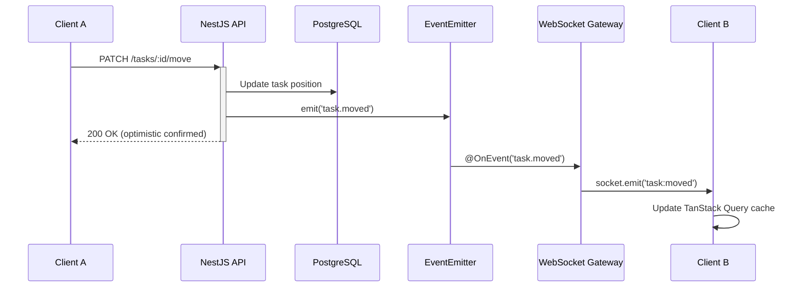

# FlowBoard

I built FlowBoard because I was tired of the timezone gap eating my deadlines. I coordinate with clients in San Francisco and Amsterdam from my desk in the Philippines — that's a 13-hour window where nothing overlaps. Every task board I tried was built for teams in the same office. FlowBoard started as my answer to async-first project management.

I was managing three client projects at the same time — US timezones, EU timezones, and local Philippine clients — and every tool I tried was either too heavy for solo freelance work or too simple to actually track what was blocked and why. Trello felt like sticky notes on a wall. Jira felt like filing taxes. I just wanted something in between: real drag-and-drop, instant updates if a client was also looking at the board, and enough structure to feel professional.

It's a real-time collaborative task management app with a Kanban board, workspace roles, project analytics, and an AI command palette for creating tasks from plain English. The stack is Next.js 15 + NestJS + PostgreSQL + Redis + WebSockets, organized as a pnpm monorepo.

This is also my most technically ambitious portfolio project to date. The architecture decisions were intentional — I wanted to demonstrate that I can build systems that actually scale, not just systems that work on localhost.


---

## What It Does

- **Kanban Board** -- Drag-and-drop cards across columns with smooth animations and optimistic updates. Position is stored using fractional indexing so reordering is a single database write, not a cascade.
- **Real-Time Collaboration** -- WebSocket-powered live sync via Socket.IO. Changes made by one user appear instantly on every connected client. Sender exclusion keeps the UI snappy (your own optimistic update doesn't get overwritten by the echo).
- **Workspaces and RBAC** -- Multi-tenant workspaces with four roles: Owner, Admin, Member, Viewer. Permission guards run on every REST endpoint and every WebSocket event room.
- **AI Task Parsing** -- Command palette (Ctrl+K) lets you type something like "Fix auth bug, high priority, assign to Sarah, due Friday" and it parses that into structured task fields using Claude. It's genuinely the feature I use most in day-to-day testing.
- **Project Analytics** -- Dashboard with task distribution, priority breakdown, team workload, velocity tracking, and overdue monitoring. Useful for actually seeing where work is piling up.
- **Rich Task Details** -- Subtasks, labels, due dates, story points, assignees, TipTap rich-text comments, and a full activity audit trail.
- **Background Jobs** -- Bull queue handles email digests and scheduled overdue-task checks without blocking the API.

---

## Tech Stack

| Layer        | Technology                                       |
|--------------|--------------------------------------------------|
| Frontend     | Next.js 15 (App Router), React 19, Tailwind CSS v4 |
| State        | Zustand (client state), TanStack Query (server state) |
| Backend      | NestJS 10 (modular monolith)                     |
| Database     | PostgreSQL 16 via Prisma ORM                     |
| Cache / Auth | Redis 7 (refresh tokens, pub-sub, caching)       |
| Real-Time    | Socket.IO WebSocket gateway                      |
| Drag & Drop  | @dnd-kit                                         |
| Charts       | Recharts                                         |
| Monorepo     | pnpm workspaces                                  |

---

## Screenshots

| Board View | Analytics Dashboard |
|---|---|
|  |  |

| Command Palette | Dark Mode |
|---|---|
|  |  |

---

## Architecture Overview

### Monorepo Structure

```
flowboard/
  apps/
    api/          # NestJS backend (REST + WebSocket)
    web/          # Next.js 15 frontend (App Router)
    shared/       # Shared types and utilities
  packages/
  docker-compose.yml
  pnpm-workspace.yaml
```

### Backend Module Map

```
apps/api/src/
  auth/           # JWT authentication, refresh-token rotation, guards
  users/          # User CRUD, profile management
  workspaces/     # Workspace CRUD, member management, RBAC
  projects/       # Project CRUD, analytics endpoints
  tasks/          # Task CRUD, move/reorder, subtasks
  comments/       # Task comments with rich text
  labels/         # Workspace-scoped labels
  notifications/  # In-app notification system
  audit/          # Activity audit trail
  gateway/        # Socket.IO WebSocket gateway for real-time events
  prisma/         # Prisma service, schema, migrations, seed
  common/         # Shared decorators, guards, filters, pipes
```

### Data Model

```
User  ---< WorkspaceMember >---  Workspace
                                    |
                                 Project
                                    |
                                  Task ---< Comment
                                   |  \---< TaskLabel >--- Label
                                   |
                                SubTask (self-relation)
```

Users belong to Workspaces through a membership join table that carries their role. Each Workspace contains Projects; each Project contains Tasks. Tasks support self-referencing parent/child relationships for subtasks, and Labels are scoped to the Workspace so you do not end up with label soup across unrelated projects.

### Real-Time Flow



The REST controller handles the write and returns immediately to the caller. An internal EventEmitter event (`task.moved`) decouples the domain logic from the WebSocket broadcast — the gateway picks it up and fans out to every other connected client in the board room. This keeps the controller clean and makes it easy to add more side effects (audit log, notification) without touching the controller at all.

---

## Challenges and Failures

This is the part most READMEs skip. Here is what actually went wrong.

### I tried polling first. It was a mistake.

I tried polling for real-time first. The network tab looked like a crime scene — 4 requests per second per client. Every poll was a full board fetch. Two users on the same board generated four database queries per second between them. The updates felt delayed and the UI felt dead.

Switching to Socket.IO with event-scoped payloads (only send what changed, not the whole board) dropped the real-time data transfer to nearly nothing and made the UI feel genuinely live. Should have started there.

### WebSocket events were not reaching other browser tabs

Spent 2 days debugging why WebSocket events weren't reaching other browser tabs. Everything worked with one client connected. When I opened a second browser tab, events from Tab A were not reaching Tab B. I confirmed the socket connections were established, the rooms were correct, and the events were firing from the gateway.

The problem: I was running two Node.js processes and each process had its own in-memory Socket.IO server. Tab A was connected to Process 1. Tab B was connected to Process 2. They never shared state.

Turns out a single Socket.io server can't broadcast across Node instances. Added Redis pub-sub adapter (`@socket.io/redis-adapter`). Once Redis is the message bus, it does not matter which process a client connects to — the event reaches all of them. Very much not obvious at 1am.

### react-beautiful-dnd had to go

My first drag-and-drop used react-beautiful-dnd. It's archived, has React 18 bugs. Midway through building the cross-column reorder logic I checked the repository and realized no updates since 2022, known issues with React 18 strict mode, and the animations looked dated.

Rewrote with @dnd-kit in a weekend. It is more verbose to set up but actively maintained, supports pointer, keyboard, and touch interaction modes out of the box, and gives you fine-grained control over collision detection — which matters a lot when you have variable-height cards across multiple columns. The result is significantly cleaner.

### Fractional indexing is not as simple as the blog posts make it sound

Fractional indexing was my rabbit hole. The first implementation used integers — worked until two people dragged simultaneously and wrote the same position. Every article about drag-and-drop ordering says "just use fractional indexing" and then shows a three-line example. What they do not mention is what happens when you run out of precision — when two items get positioned so close together that the floating-point midpoint between them is equal to one of them.

The solution is periodic rebalancing: when the gap between two adjacent positions falls below a threshold, redistribute all positions in that column using fresh evenly-spaced values. It is the kind of edge case that only shows up after hundreds of moves on the same column, but when it does show up without handling, cards start teleporting.

---

## What I Learned Building This

### A modular monolith is almost always the right starting point

I spent a week planning microservices before I started coding. Then I remembered I'm one person. A modular monolith with clean module boundaries gives me the same isolation without the deployment tax.

I switched to a NestJS modular monolith. Each domain (tasks, workspaces, projects, auth) is a self-contained module with its own controller, service, and DTOs. The modules cannot reach into each other's internals — they communicate through the EventEmitter bus. If this ever needs to scale to a point where microservices are justified, extracting a module into a service is a real option. But starting there would have meant spending most of my time on infrastructure instead of the actual product.

### Prisma is worth it, but understand what you are trading

Prisma's generated client is excellent. The schema file is readable in code review, the migrations are reliable, and the TypeScript types flow through the entire backend without manual DTO mapping.

The tradeoff is that Prisma generates its own query patterns and you lose some of the raw SQL expressiveness of something like Drizzle. For complex analytics queries I ended up dropping to `prisma.$queryRaw` anyway. But for 90% of the CRUD surface, Prisma's ergonomics are far ahead of TypeORM's decorator-based approach, which kept surprising me with runtime behavior that did not match what the type system implied.

### Zustand + TanStack Query is a clean split

The mental model I landed on: TanStack Query owns everything that comes from the server. Zustand owns everything that is purely UI state — sidebar open/closed, which modal is visible, command palette state. Once I committed to that boundary it became obvious where new state should live. Before that I kept second-guessing every piece of state.

If you are reaching for Redux in a project like this, I would challenge that decision. Redux Toolkit adds real overhead (slices, thunks, selectors) for problems that TanStack Query already solves better.

### Redis is doing more work than I expected

I added Redis initially just for refresh token storage. Over the course of the build it also became the Socket.IO pub-sub adapter, the caching layer for workspace membership checks, and the Bull queue backend for background jobs. It is pulling four different jobs and the operational overhead is just one Docker container. For a production deployment I would take that trade every time.

### Event-driven architecture is worth the extra indirection

Event-driven decoupling wasn't in my original plan. It emerged from testing — the first version had the WebSocket gateway importing TasksService directly. Couldn't test either in isolation.

Connecting the REST layer to the WebSocket layer through an internal EventEmitter felt like over-engineering at first. Why not just call the gateway directly from the controller? The answer became clear when I added the audit log and the notification system. Both of them subscribe to the same domain events (`task.created`, `task.moved`, `comment.added`) without touching any controller. Adding a new side effect is a matter of writing a new `@OnEvent` handler. Without the event bus, every new side effect would require touching the controller — the wrong layer for that logic.

---

## Getting Started

### Prerequisites

- Node.js >= 22
- pnpm >= 10
- Docker and Docker Compose (for PostgreSQL and Redis)

### Setup

```bash
# 1. Clone the repository
git clone https://github.com/jeromejhipolito/flowboard.git
cd flowboard

# 2. Install dependencies
pnpm install

# 3. Start infrastructure (PostgreSQL + Redis)
docker compose up -d

# 4. Copy environment variables
cp apps/api/.env.example apps/api/.env

# 5. Run database migrations
pnpm db:migrate

# 6. Seed the database with sample data
pnpm db:seed

# 7. Start development servers (API + Web run in parallel)
pnpm dev
```

API runs at **http://localhost:3001** and the web app at **http://localhost:3000**.

### API Docs

Swagger UI is available at `http://localhost:3001/api/docs` once the API is running.

---

## What Is Next

Things I actually want to build, not a feature matrix:

- **GitHub integration** -- I want to link a task to a PR and have the task auto-close when the PR merges. This is the feature I miss most from Jira without wanting the rest of Jira.
- **Email notifications** -- The Bull queue is already wired and the job skeleton exists. I just need to connect it to a real email provider and design the templates. Probably Resend.
- **Timeline view** -- A Gantt-style view for seeing how tasks overlap across a project. Useful for client work where deadlines are not independent.
- **File attachments** -- Drag a file onto a task card and have it upload to S3. Straightforward but I wanted to ship the core first.
- **Custom fields** -- Let workspaces define their own task fields. This is the one that unlocks FlowBoard for non-software teams.
- **Mobile** -- A React Native companion app using the same API. Lower priority but the API is already designed with this in mind (no server-side rendering dependencies).
- **CI/CD pipeline** -- GitHub Actions for lint, test, and deploy. I want to get this done before I start sharing the repo more widely.

---

## About Me

I'm Jerome -- a full-stack developer based in the Philippines with 5 years of production TypeScript. I work solo across freelance and startup projects, which means I make architecture decisions without a committee and live with the consequences. I'm looking for remote engineering roles with US or EU teams working on real-time, API-heavy, or collaboration products. I'd like to talk.

- Portfolio: [coming soon](#)
- GitHub: [github.com/jeromejhipolito](https://github.com/jeromejhipolito)
- LinkedIn: [linkedin.com/in/jeromejhipolito](https://linkedin.com/in/jeromejhipolito)
